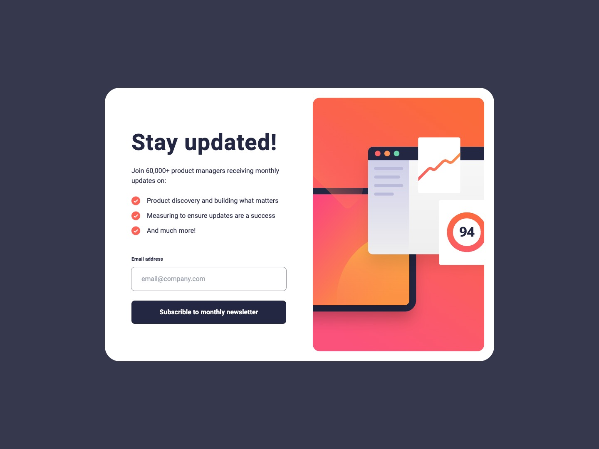

# Frontend Mentor - Newsletter sign-up form with success message solution

This is a solution to the [Newsletter sign-up form with success message challenge on Frontend Mentor](https://www.frontendmentor.io/challenges/newsletter-signup-form-with-success-message-3FC1AZbNrv). Frontend Mentor challenges help you improve your coding skills by building realistic projects.

## Table of contents

- [Overview](#overview)
  - [The challenge](#the-challenge)
  - [Screenshot](#screenshot)
  - [Links](#links)
- [My process](#my-process)
  - [Built with](#built-with)
  - [What I learned](#what-i-learned)
  - [Continued development](#continued-development)
  - [Useful resources](#useful-resources)
- [Author](#author)
- [Acknowledgments](#acknowledgments)

## Overview

This was a good project to work on and grow front end skills. It is desktop and mobile friendly. I took a desktop first approach and then adapted it to mobile. I went with vite+react as my framework and tailwind CSS to style.

### The challenge

Users should be able to:

- Add their email and submit the form
- See a success message with their email after successfully submitting the form
- See form validation messages if:
  - The field is left empty
  - The email address is not formatted correctly
- View the optimal layout for the interface depending on their device's screen size
- See hover and focus states for all interactive elements on the page

### Screenshot

You can see other screenshots in the screenshots folder.

### Links

- Solution URL: [Github Repo](https://github.com/calebmcmains/fm-newsletter-sign-up-form)
- Live Site URL: [Github Page](https://calebmcmains.github.io/fm-newsletter-sign-up-form/)

## My process

### Built with

- Semantic HTML5 markup inside react components
- TailwindCSS exclusively
- Flexbox
- CSS Grid
- Desktop-first workflow
- [React](https://reactjs.org/) - JS library
- [Vite](https://vitejs.dev) - Frontend tooling
- [TailwindCSS](https://tailwindcss.com) - Styling Framework

### What I learned

### Continued development

### Useful resources

- [Google](https://www.google.com) - I'm serious...don't hesitate to google things....but please work on being GOOD and googling. There is a difference.
- [React Documentation](https://react.dev) - This was a very helpful in understanding how react works.

## Author

- Website - [Caleb McMains](https://www.calebmcmains.com)
- Frontend Mentor - [@calebmcmains](https://www.frontendmentor.io/profile/calebmcmains)

## Acknowledgments

Shout out to Kyle with [Web Dev Simplified](https://courses.webdevsimplified.com), great react content [Web Dev Simplified YouTube](https://www.youtube.com/c/WebDevSimplified)
